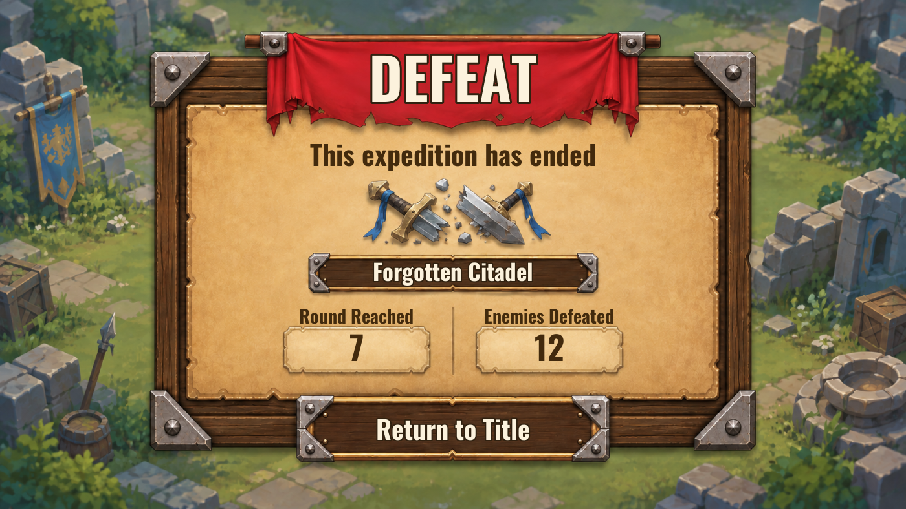

# 패배 화면 — 선택한 1안 구현

원화: `Content/SVN/SourceArt/UI/DefeatClassic_20260916/T_DefeatClassicBlank_v1.png`

런타임 텍스처: `/Game/SVN/OutSideAsset/AICreation/UI/DefeatClassic_20260916/T_DefeatClassicBlank_v1`

Built-in image generation editing tool 사용. 승인한 시안에서 글자만 제거했으며, 표시 문구와 실제 통계는 UMG에서 그린다. 캐릭터·생존·보상 항목은 표시하지 않는다.

## Prompt

Use case: precise-object-edit. Edit target: supplied approved defeat game UI. Produce a production background plate by REMOVING ALL TEXT AND NUMERALS ONLY: remove Korean title on red cloth, subtitle on parchment, location text on small wood plaque, both stat labels, both numbers 7 and 12, and bottom button label. Inpaint removed text seamlessly using the surrounding material. Keep EVERYTHING ELSE EXACTLY THE SAME: identical layout and proportions, identical wood frame, silver corners and rivets, red tattered banner, parchment, broken swords, blue ribbons, two stat boxes, divider, bottom button, empty ruined green battlefield background. No characters. No new objects. No typography whatsoever. Preserve full 16:9 image composition and all object positions; no crop, no redesign. This is a clean blank UI texture for native localized text overlays.

## 로컬 테스트

- `PlayDefeatPreview.ps1` 실행: 정상 인트로·리소스 로드 후 패배 미리보기가 자동으로 열린다.
- 미리보기의 7라운드·12처치는 견본 값이며 저장된 원정 결과를 바꾸지 않는다. 타이틀 버튼은 미리보기를 닫는다.
- 실제 전투 패배에서는 현재 스테이지 DA의 지역명과 결과 모델의 라운드·처치 수를 표시하며 기존 타이틀 복귀 흐름을 사용한다.
- Editor Development 빌드 성공. `P_RD.UI.CombatDefeat.ClassicBoard` 통과: 실제 값 갱신, 중복 클릭 1회 처리, 캐릭터·생존 항목 제거, 한국어·영어, 1920×1080 및 1400×1165 버튼 화면 안 배치 검증.
- SVN을 갱신하여 위 원화와 런타임 텍스처를 받은 뒤 사용한다. 위젯 재생성 명령은 `RD.Editor.BuildCombatDefeat`이다.
- 지역명은 명패 중앙에 보이도록 텍스트 영역을 위로 8px 보정했다.

