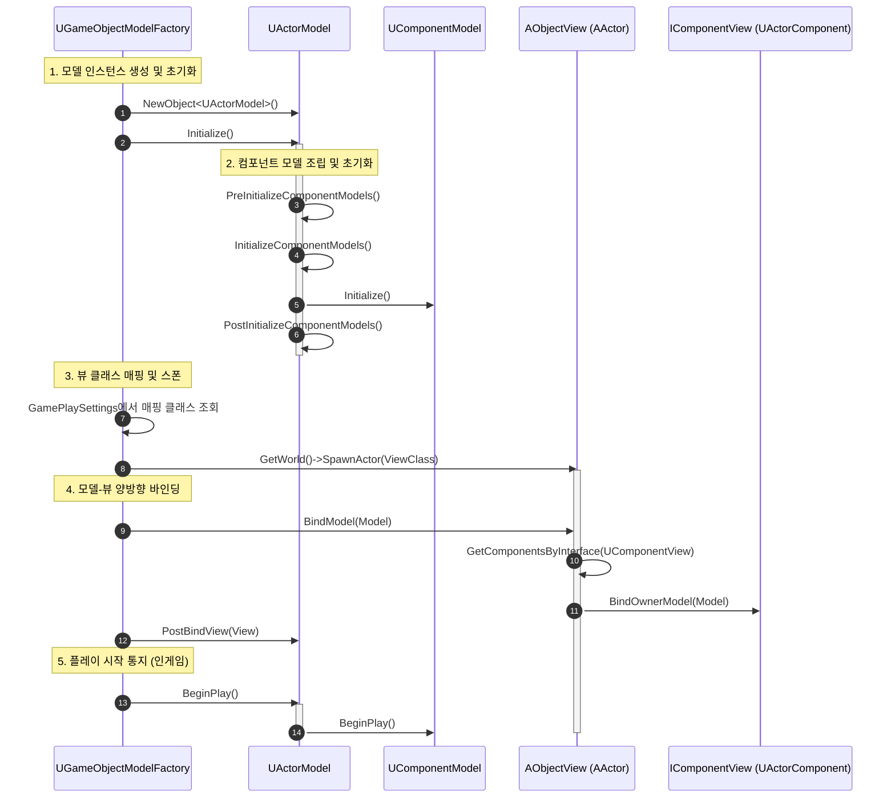
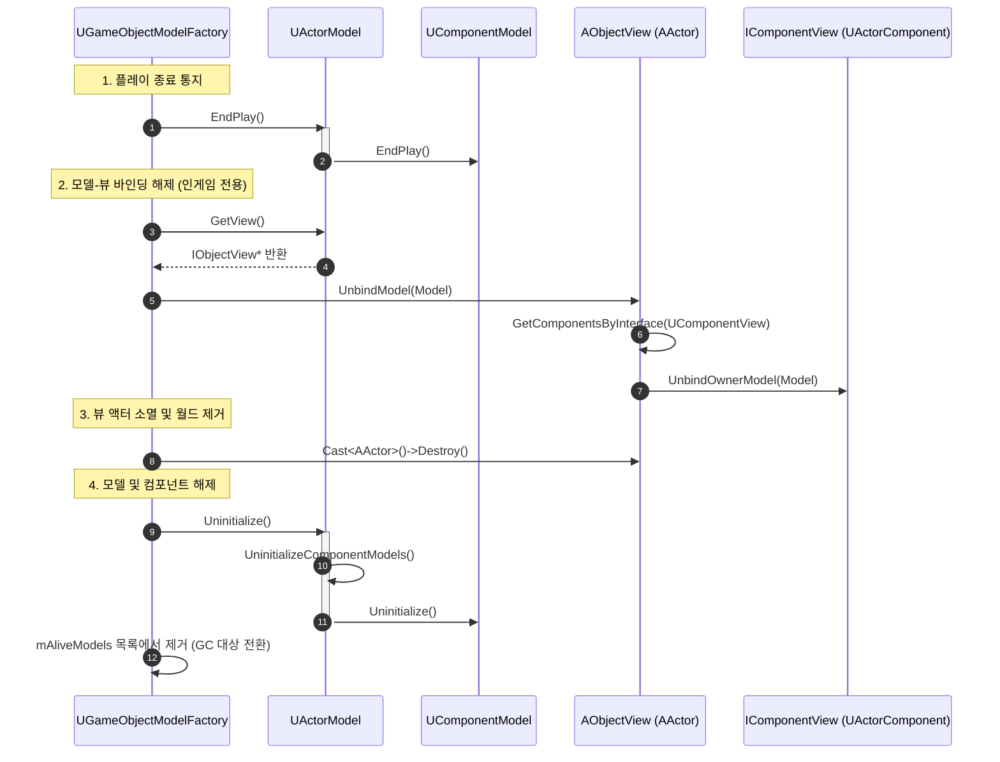

# Model-View 프레임워크

본 리포트는 **Model-View 프레임워크**의 핵심 설계, **인게임(Game) 및 시뮬레이션(Simulation) 환경에 따른 이원화 동작 구조**, 그리고 **컴포넌트 데이터 모델(ComponentModel) 기반의 모듈화 구조**를 포함한 모델과 뷰의 생성, 소멸 생명 주기(Lifecycle) 및 상호 작용 흐름을 시각화하고 정리한 문서입니다.

---

## 1. 이원화 컨텍스트 및 동작 모드 (USimulationSubsystem)

시뮬레이션 서브시스템(`USimulationSubsystem`)은 게임 모드와 순수 시뮬레이션 모드라는 두 가지 환경을 상태(`ESRPGSimulationState`)에 따라 이원화하여 관리하며, 각 상황에 적절한 방의 맥락(`FRoomContext`)을 선택적으로 제공합니다.

### 🔄 컨텍스트 관리 구조
* **상태 정의 (`ESRPGSimulationState`)**
  * `RunningGame`: 실제 플레이어가 눈으로 보고 조작하는 인게임 진행 모드입니다.
  * `RunningSimulation`: 화면 렌더링이나 뷰(View) 액터 없이 백그라운드에서 논리적인 시뮬레이션만 빠르게 수행하는 모드입니다.
* **컨텍스트 선택 메커니즘**
  * 서브시스템은 게임용 컨텍스트(`mGameRoomContext`)와 시뮬레이션용 컨텍스트(`mSimulationRoomContext`)를 모두 소유하고 있습니다.
  * 현재 실행 모드(`mSimulationState`)에 맞춰 활성화된 컨텍스트의 주소를 `mCurrentRoomContext` 포인터에 바인딩하여 시스템 전반에 전달합니다.

---

## 2. 생성 단계 (Creation Phase)

모델 생성 시 팩토리(`UObjectModelFactory`)는 활성화된 모드에 따라 뷰(View)를 함께 생성하여 양방향 바인딩을 진행할지, 아니면 순수하게 데이터 모델만 메모리에 올릴지 결정합니다. 또한 `UActorModel`인 경우 내부에 부착된 컴포넌트 모델(`UComponentModel`)들의 초기화 과정을 함께 처리합니다.

### 🔄 생성 동작 비교
| 구분 | 인게임 모드 (`UGameObjectModelFactory`) | 시뮬레이션 모드 (`USimulationObjectModelFactory`) |
| :--- | :--- | :--- |
| **생성 대상** | 모델(Model) + 뷰 액터(AObjectView) | 순수 모델(Model)만 생성 |
| **뷰 바인딩** | 팩토리가 뷰 스폰 및 양방향 바인딩(`BindModel`/`PostBindView`) 수행 | 뷰를 생성하지 않으며 바인딩 과정 생략 |
| **성능 특징** | 렌더링 및 월드 스폰 오버헤드 존재 | 시각적 요소가 없어 초고속 백그라운드 연산 가능 |

### 🔄 생성 시퀀스 다이어그램 (인게임 모드 기준)

### 💡 생성 단계 상세 흐름
1. **모델 생성 및 컨텍스트 바인딩**: `UObjectModelFactory::NewModel_Internal`에서 `NewObject`로 모델을 인스턴스화하고 현재 활성화된 `FRoomContext`를 바인딩합니다.
2. **모델 초기화 & 컴포넌트 조립**: 모델의 `Initialize()`가 호출됩니다. 특히 `UActorModel`은 내부의 컴포넌트 목록(`mComponentModels`)을 순회하며 각 `UComponentModel::Initialize()`를 호출해 기능을 조립합니다.
3. **뷰 스폰 (인게임 전용)**: `UGameObjectModelFactory::OnPostCreateNewModel`에서 클래스 매핑 설정(`mModelViewMappings`)에 따라 뷰 역할을 할 언리얼 액터(`AObjectView`)를 레벨에 스폰합니다. 시뮬레이션 모드(`USimulationObjectModelFactory`)에서는 이 단계가 수행되지 않습니다.
4. **양방향 바인딩 (인게임 전용)**: 스폰된 뷰 객체의 `BindModel(Model)`을 호출합니다. 뷰 액터는 자신에게 부착된 모든 컴포넌트 뷰(`IComponentView`)를 찾아 컴포넌트 뷰들에게 모델 인스턴스를 전달(`BindOwnerModel`)합니다. 이어서 모델의 `PostBindView(View)`를 호출하여 모델이 뷰를 약참조(`TWeakObjectPtr`)할 수 있도록 저장합니다.
5. **플레이 시작 통지**: 최종적으로 모델의 `BeginPlay()`를 호출합니다. `UActorModel`은 소유한 컴포넌트 모델들의 `BeginPlay()`를 연쇄적으로 호출하여 작동을 시작합니다.

---

## 3. 소멸 단계 (Destruction Phase)

모델 소멸 시 팩토리는 시뮬레이션 종료를 모델에 알리고, 생성된 컴포넌트와 바인딩된 뷰를 정리한 뒤 가비지 컬렉션(GC) 대상이 되도록 처리합니다.

### 🔄 소멸 시퀀스 다이어그램 (인게임 모드 기준)

### 💡 소멸 단계 상세 흐름
1. **시뮬레이션 종료 통지**: 모델의 `EndPlay()`를 호출하여 실행을 중단합니다. `UActorModel`은 내부 컴포넌트 모델들의 `EndPlay()`를 호출하여 관련 기능을 안전하게 종료합니다.
2. **바인딩 해제 및 뷰 소멸 (인게임 전용)**: `UGameObjectModelFactory::OnPreRemoveModel`에서 뷰의 `UnbindModel`을 호출하여 의존성을 끊고, 뷰 액터를 레벨 상에서 `Destroy()`하여 월드에서 완전히 삭제합니다.
3. **모델 해제 & GC 유도**: 모델의 `Uninitialize()`를 호출합니다. `UActorModel`은 모든 컴포넌트 모델들의 `Uninitialize()`를 차례로 호출하여 메모리 해제 준비를 끝마칩니다. 이후 팩토리의 활성 모델 관리 목록(`mAliveModels`)에서 스왑 제거(`RemoveAtSwap`)하여 가비지 컬렉터가 수거하도록 유도합니다.

---

## 4. 컴포넌트 모델 구조 (UActorModel & UComponentModel)

`UComponentModel`은 패시브 효과, 장착 아이템 등 다양한 상태나 기능을 퍼즐처럼 유연하게 조립하여 `UActorModel`에 확장할 수 있게 하는 컴포넌트 데이터 모델 클래스입니다.

* **인스턴스 생성 방식**
  * 일반 언리얼 엔진의 `ActorComponent` 생성 및 등록 흐름과 구조적으로 동일하게 동작합니다.
  * `UActorModel`의 `AddComponentModelByClass` 메서드를 활용하여 런타임 혹은 초기화 단계에 유연하게 추가할 수 있습니다.
* **조립성 및 생명 주기 동기화**
  * 액터 모델은 하위 컴포넌트 모델들을 `TSet<TObjectPtr<UComponentModel>> mComponentModels` 컨테이너로 관리합니다.
  * 액터 모델의 `Initialize()`, `BeginPlay()`, `EndPlay()`, `Uninitialize()` 생명 주기 함수가 호출될 때, 소유한 모든 컴포넌트 모델들로 동일한 생명 주기 호출이 전파됩니다.

---

## 5. 시뮬레이션 결과 기록 시스템 (UEventLogger)

서브시스템 내에서 발생하는 각종 턴, 행동, 모션 결과들은 `UEventLogger`를 통해 로깅됩니다. 이 또한 팩토리와 유사하게 실행 상황에 맞춰 기록 여부가 이원화됩니다.

* **인게임 이벤트 로거 (`UGameEventLogger`)**
  * 실제 인게임 동작 시 호출되며, 로그 기록 행위가 화면 연출이나 다른 뷰 메커니즘을 통해 실시간 표현되기 때문에 로거 내부에서는 로그 기록을 무시(Ignore)하거나 단순 전달만 하고 수집하지 않습니다.
* **시뮬레이션 이벤트 로거 (`USimulationEventLogger`)**
  * 순수 시뮬레이션 모드에서 동작하며, `mTurnEventLogs` 배열을 포함한 구조화된 데이터 구조에 턴별 이벤트 로그(`FSRPGTurnEventLog`, `FSRPGActionEventLog`, `FSRPGMotionEventLog`)를 계층적으로 기록하고 저장합니다.
  * 시뮬레이션이 종료되거나 특정 구간을 지나면 `PopSRPGLogs()`를 통해 축적된 상세 데이터를 일괄적으로 반환받아 시뮬레이션 결과 리포트를 작성하는 데 활용합니다.
