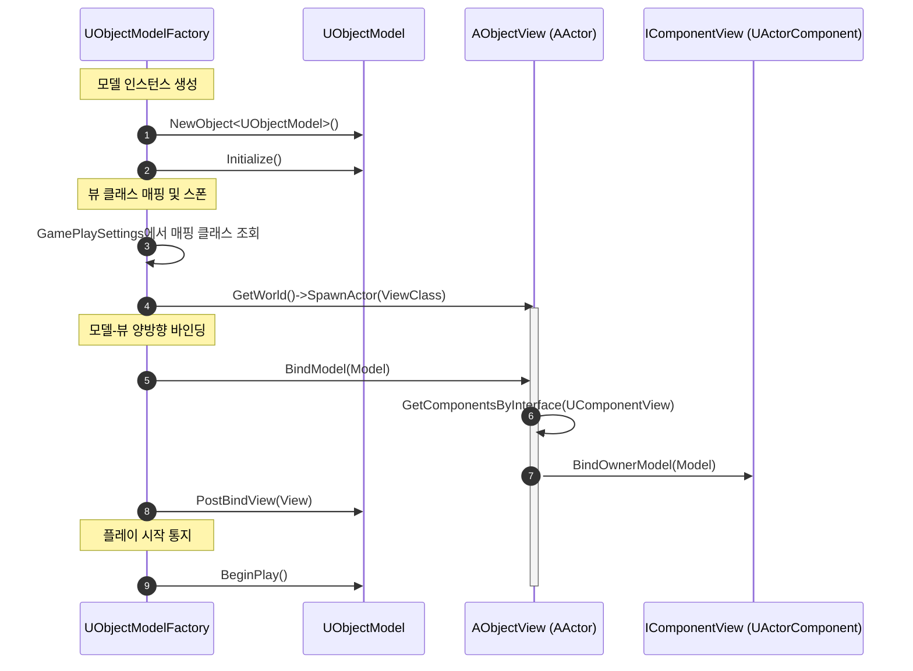
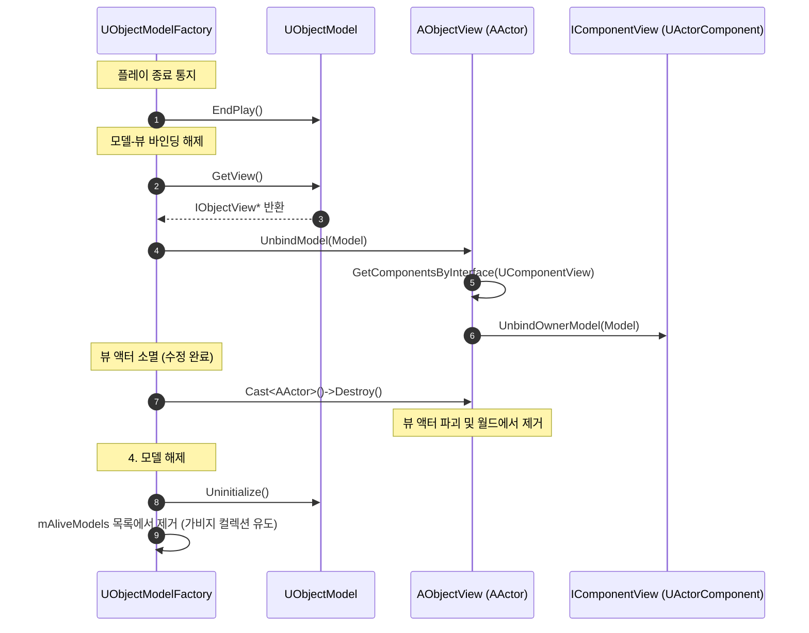

# Model-View 프레임워크

**Model과 View의 생성 및 소멸 생명 주기(Lifecycle)**와 **상호 작용 흐름**을 시각화하고 정리한 리포트입니다.

---

## 1. 생성 단계 (Creation Phase)

모델이 생성될 때 팩토리는 모델을 먼저 인스턴스화하고 초기화한 뒤, 매핑 테이블 정보를 확인하여 대응되는 뷰 액터(AActor)를 스폰하고 양방향 바인딩을 수행합니다.

### 🔄 생성 시퀀스 다이어그램

### 💡 생성 단계 상세 흐름
1. **모델 생성 및 등록**: `UObjectModelFactory::NewModel_Internal`에서 `NewObject`로 모델을 생성하고, `RoomInstance`의 활성 모델 관리 목록(`mAliveModels`)에 등록합니다.
2. **모델 초기화**: 모델의 `Initialize()`를 가장 먼저 호출하여 데이터 준비 작업을 처리합니다.
3. **뷰 액터 스폰**: `UGameObjectModelFactory::OnPostCreateNewModel`에서 클래스 매핑 설정(`mModelViewMappings`)에 따라 뷰 역할을 할 언리얼 액터를 레벨 상에 스폰합니다.
4. **뷰에 모델 바인딩**: 스폰된 뷰 객체의 `BindModel(Model)`을 호출합니다. 이때 뷰 액터는 자신에게 부착된 모든 컴포넌트 뷰(`IComponentView`)를 찾아 컴포넌트 뷰들에게 모델 인스턴스를 전달(`BindOwnerModel`)합니다.
5. **모델에 뷰 바인딩**: 모델의 `PostBindView(View)`를 호출하여 모델이 뷰를 약참조(`TWeakObjectPtr`)할 수 있도록 저장합니다.
6. **플레이 시작**: 최종적으로 모델의 `BeginPlay()`를 호출하여 시뮬레이션 데이터를 활성화합니다.

---

## 2. 소멸 단계 (Destruction Phase)

모델 소멸 시 팩토리는 시뮬레이션 종료를 모델에 먼저 알리고, 바인딩된 뷰와의 연결을 해제한 후, 연결된 뷰 액터를 파괴하고 가비지 컬렉션(GC) 대상이 되도록 처리합니다.

### 🔄 소멸 시퀀스 다이어그램

### 💡 소멸 단계 상세 흐름
1. **시뮬레이션 종료 통지**: 모델의 `EndPlay()`를 호출하여 시뮬레이션 루프 정지 등의 작업을 처리합니다.
2. **바인딩 해제**: 모델이 잡고 있던 뷰의 `UnbindModel(Model)`을 호출합니다. 뷰 액터는 다시 하위 컴포넌트 뷰(`IComponentView`)들에 소멸 사실(`UnbindOwnerModel`)을 알립니다.
3. **뷰 액터 파괴**: `UGameObjectModelFactory::OnPreRemoveModel`에서 뷰 인터페이스를 `AActor*`로 캐스팅한 후, `Destroy()`를 호출해 레벨 상에서 안전하게 제거합니다.
4. **모델 해제**: 모델의 `Uninitialize()`를 호출한 뒤, 팩토리의 `mAliveModels` 목록에서 스왑 제거(`RemoveAtSwap`)하여 가비지 컬렉션(GC) 대상이 되도록 만듭니다.
